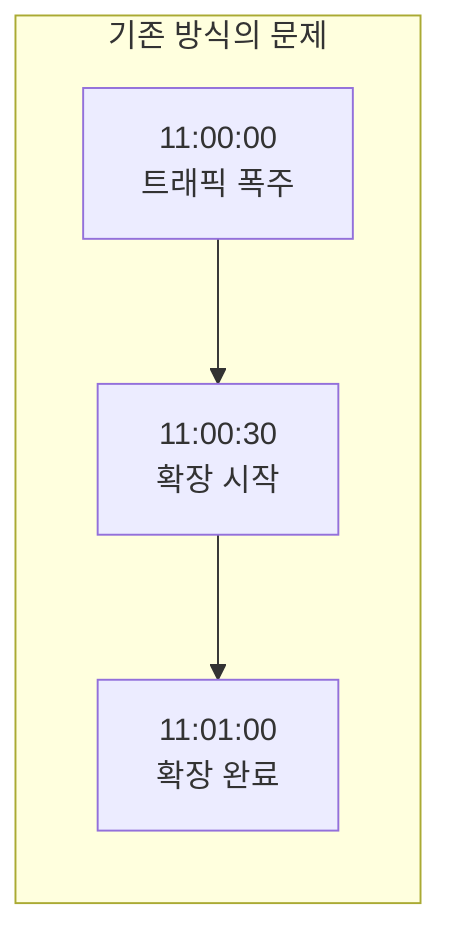
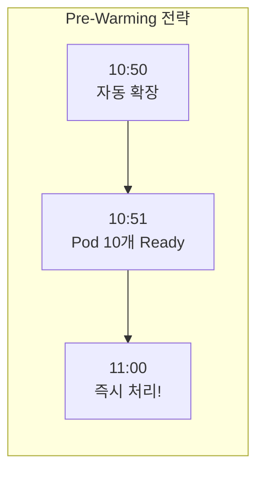

# 트래픽 대응

티켓팅 서비스는 오픈 시각에 트래픽이 순간적으로 집중됩니다. 트래픽이 발생한 이후에 Pod를 확장하면 수십 초~1분의 지연이 생겨 사용자 경험이 크게 저하됩니다.

---

## 문제점

트래픽 발생 후 Pod 확장까지 **수십 초~1분 지연** 발생. 이 구간 동안 사용자 요청이 처리되지 못해 타임아웃과 에러가 집중됩니다.

---

## 해결 전략: Pre-Warming

KEDA Cron 스케줄러를 활용해 티켓 오픈 **10분 전에 Pod를 미리 확장**합니다. 11시 정각에는 이미 서버가 준비 완료된 상태로, 트래픽이 몰려도 응답 지연 없이 즉시 처리됩니다.

---

## 확장 전략 조합

| 전략 | 도구 | 효과 |
|---|---|---|
| **Pre-Warming** | KEDA Cron | 티켓 오픈 10분 전 미리 확장 |
| **Pod 자동 확장** | HPA (Horizontal Pod Autoscaler) | 실시간 부하 기반 Pod 증감 |
| **Node 자동 확장** | Karpenter | 노드 자동 증설로 피크 대응 |

Karpenter를 통해 **60초 내에 새 노드를 추가**하고, Spot 인스턴스를 활용해 비용을 절감합니다. HPA와 KEDA를 함께 사용해 Pod 수준과 노드 수준의 이중 확장 체계를 갖춥니다.
