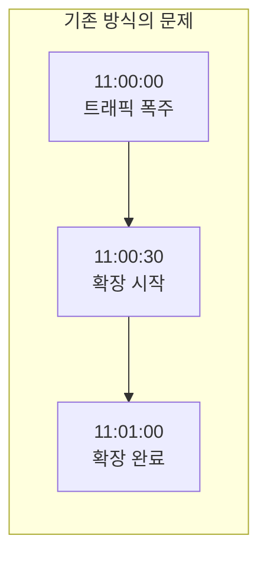
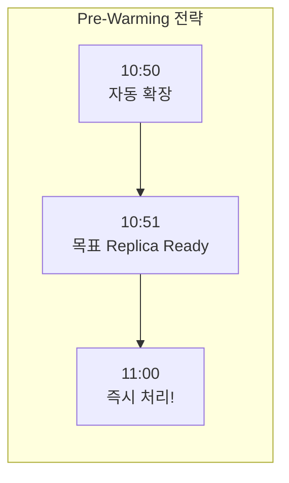

# 트래픽 대응

티켓팅 서비스는 오픈 시각에 트래픽이 순간적으로 집중됩니다. 트래픽이 발생한 이후에 Pod를 확장하면 수십 초 단위 지연이 생겨 사용자 경험이 크게 저하됩니다. 현재 운영 기준은 KEDA Pre-Warming, HPA, Karpenter를 조합해 피크 직전과 피크 중을 나눠 대응하는 방식입니다.

---

## 문제점

트래픽 발생 후 Pod 확장까지 **수십 초 단위 지연**이 발생합니다. 이 구간 동안 사용자 요청이 처리되지 못해 타임아웃과 에러가 집중됩니다.

---

## 해결 전략: Pre-Warming

KEDA Cron 스케줄러를 활용해 티켓 오픈 전에 Pod를 미리 확장합니다. 실제 Pre-Warming 시작 시각과 목표 replica 수는 경기/이벤트 특성, 부하테스트 결과, 최근 운영 지표를 기준으로 조정합니다.

---

## 확장 전략 조합

| 전략 | 도구 | 효과 |
|---|---|---|
| **Pre-Warming** | KEDA Cron | 오픈 직전 목표 replica를 선반영 |
| **Pod 자동 확장** | HPA (Horizontal Pod Autoscaler) | 실시간 부하 기반 Pod 증감 |
| **Node 자동 확장** | Karpenter | 노드 자동 증설로 피크 대응 |

HPA와 KEDA를 함께 사용해 Pod 수준에서 먼저 대응하고, Karpenter가 노드 수준 확장을 보조합니다. 확장 정책은 고정값으로 끝내지 않고, 모니터링과 부하테스트 결과를 바탕으로 지속 보정합니다.

---

## 운영 원칙

- **Pre-Warming은 고정 숫자가 아님**: 이벤트별 예상 트래픽과 최근 운영 데이터를 기준으로 조정
- **실시간 확장과 사전 확장을 분리**: KEDA는 오픈 직전, HPA는 오픈 이후 실시간 대응
- **노드 증설은 보조 수단**: Pod 준비가 늦지 않도록 Node 확장만 믿지 않고 선확장 우선
- **정책은 주기적으로 업데이트**: 요청량, 응답시간, DB 연결률, Pod 리소스 사용률을 기준으로 값 조정
