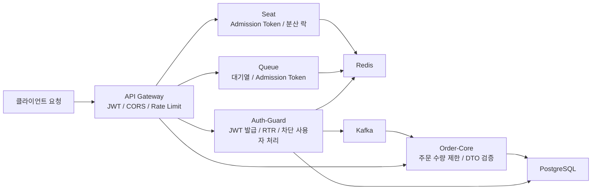

# 백엔드 방어 체계

> **역할**: 앱 계층 최종 방어 · JWT / Admission Token

Playball 백엔드는 Gateway, 인증, 대기열, 좌석, 주문 계층에서 요청을 다시 검증하고, 토큰·동시성·민감정보 보호 기준을 함께 유지합니다.

---

## 전체 처리 구조

---

## 서비스별 방어 기준

| 영역 | 주요 구성 | 적용 기준 |
|---|---|---|
| **API Gateway** | JWT 필터, CORS 검증, Rate Limit, 사용자 정보 헤더 주입 | 미인증 요청 차단, 허용 Origin 제한, 과도한 요청 제한, 다운스트림 전달 정보 정리 |
| **Auth-Guard** | RSA 기반 JWT, Refresh Token Rotation, 블랙리스트, 차단 사용자 처리 | 위조 토큰 방지, 재사용 Refresh Token 탐지, 차단 사용자 재접근 제한 |
| **Queue** | Redis Sorted Set 대기열, Admission Token, Pre-Queue 검증 | 대기열 우회 방지, 경기별 입장 토큰 검증, 무분별한 큐 진입 제한 |
| **Seat** | Admission Token 검증, Redisson 분산 락, Booking Options 검증 | 비정상 좌석 진입 차단, 동시 선점 경합 제어, 예매 조건 불일치 방지 |
| **Order-Core** | 주문 수량 제한, DTO 유효성 검증, user-blocked 이벤트 처리 | 대량 주문 제한, 비정상 입력 차단, 차단 사용자 주문 검토 대기 전환 |
| **공통 보안 구성** | AES-GCM 암호화, 쿠키 속성, Actuator 최소 노출, Request Logging | 민감정보 보호, 브라우저 토큰 보호, 내부 정보 노출 최소화, 사후 추적 확보 |

---

## 핵심 보호 기준

| 구분 | 운영 기준 |
|---|---|
| **토큰 발급과 검증** | Auth-Guard가 RSA 기반 JWT를 발급하고 Gateway와 서비스 계층이 공개키 기준으로 검증 |
| **Refresh Token 관리** | Refresh Token Rotation과 블랙리스트를 함께 사용해 재사용 토큰을 탐지 |
| **대기열 우회 방지** | Queue에서 발급한 Admission Token을 Queue·Seat 계층에서 다시 검증 |
| **동시성 제어** | Seat 계층에서 분산 락으로 좌석 Hold 충돌을 제어 |
| **민감정보 보호** | 개인정보 필드는 AES-256-GCM 기준으로 암호화 저장 |
| **쿠키 보호** | Refresh Token과 Admission Token은 `HttpOnly`, `Secure`, `SameSite` 기준 유지 |
| **내부 API 보호** | 내부 연동 경로는 별도 인증 키와 허용 경로 기준으로 보호 |
| **사후 추적** | Request Logging, 보안 메트릭, Kafka 이벤트로 차단·주문 전환 흐름을 추적 |

---

## 서비스 간 연계 흐름

| 흐름 | 처리 기준 |
|---|---|
| **로그인 / 토큰 발급** | Auth-Guard가 Access / Refresh Token을 발급하고 Redis에 세션 상태를 기록 |
| **대기열 진입** | Queue가 경기 기준 Admission Token을 발급하고 입장 조건을 검증 |
| **좌석 선점** | Seat가 Admission Token과 분산 락 기준으로 좌석 Hold를 처리 |
| **차단 사용자 전파** | Auth-Guard 차단 이벤트를 Kafka로 전달하고 Order-Core가 활성 주문을 검토 대기로 전환 |
| **보안 추적** | 인증 실패, Rate Limit, 차단 사용자, 대기열 이상 징후를 로그와 메트릭으로 수집 |

---

## 점검 항목

| 항목 | 확인 내용 |
|---|---|
| **JWT 검증** | Gateway와 서비스 계층에서 토큰 검증이 정상인지 |
| **Refresh Token 처리** | 재발급, 만료, 재사용 탐지가 의도대로 동작하는지 |
| **Admission Token 흐름** | Queue와 Seat에서 경기/사용자 기준 검증이 정상인지 |
| **좌석 동시성 제어** | 분산 락 대기시간과 Hold 실패율이 급증하지 않는지 |
| **민감정보 보호** | 암호화 필드와 쿠키 속성이 운영 기준과 일치하는지 |
| **사후 추적** | 인증 실패, 차단 사용자, 주문 검토 대기 전환 이력이 남는지 |
