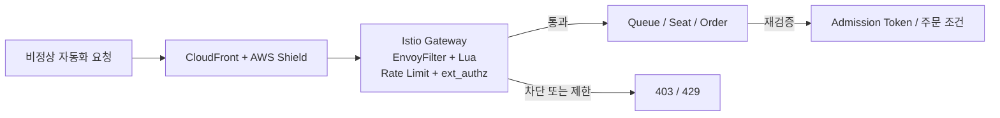

# 봇 대응 체계

Playball은 짧은 시간에 요청이 집중되는 티켓팅 특성을 기준으로 봇 대응 체계를 구성합니다. 요청 급증, 반복 접근, 대기열 우회, 좌석 선점 시도를 함께 막기 위해 Gateway 차단, 행동 판단, 애플리케이션 재검증을 연계합니다.

---

## 대응 흐름

---

## 대응 기준

| 영역 | 주요 구성 | 적용 기준 |
|---|---|---|
| **외부 진입 보호** | CloudFront, AWS Shield Standard | 대규모 요청 급증과 비정상 진입을 1차로 흡수 |
| **Gateway 차단** | EnvoyFilter + Lua | Bot Scanner, 웹 공격 패턴, 비정상 요청을 403으로 차단 |
| **요청 제한** | Local / Global Rate Limit | 과도한 요청을 429로 종료하고 서비스 내부까지 전달하지 않음 |
| **행동 판단** | ext_authz, authz-adapter, AI Defense | 대기열 진입, 좌석 선점 계열 민감 경로에 추가 판단 적용 |
| **애플리케이션 재검증** | Queue, Seat, Order | Admission Token, 좌석 Hold, 주문 조건을 다시 검증 |

---

## 주요 보호 지점

| 구분 | 처리 기준 |
|---|---|
| **대기열 진입** | 예매 옵션과 Admission Token 기준으로 정상 입장 경로를 확인 |
| **좌석 선점** | 추천 좌석, 좌석 조회, Seat Hold 계열 경로에 추가 인가 판단 적용 |
| **주문 생성** | 과도한 요청과 비정상 결제 시도를 Gateway와 주문 계층에서 함께 제한 |
| **반복 요청** | IP, 경로, 요청 패턴 기준으로 Rate Limit과 차단 로그를 추적 |
| **사후 제재** | 차단 사용자, 차단 IP, 이상 징후를 로그와 메트릭으로 남겨 후속 조치에 반영 |

---

## 운영 확인

| 항목 | 확인 경로 |
|---|---|
| **429 증가** | Grafana, Rate Limit 관련 대시보드 |
| **403 증가** | Grafana, Loki, Istio 보안 대시보드 |
| **행동 판단 이벤트** | Discord, authz-adapter 로그, AI Defense 연계 로그 |
| **대기열 우회 징후** | Queue / Seat 로그, Admission Token 검증 실패 로그 |
| **차단 사용자 추적** | CloudTrail, Discord, 백엔드 로그 |

---

## 점검 항목

| 항목 | 확인 내용 |
|---|---|
| **차단 / 제한** | 403, 429가 특정 시간대에 급증하는지 |
| **행동 판단** | ext_authz와 authz-adapter 연동이 정상인지 |
| **대기열 우회 방지** | Admission Token 없는 진입이 반복되지 않는지 |
| **좌석 선점 보호** | Hold 실패와 비정상 선점 요청이 증가하지 않는지 |
| **사후 추적** | 차단 사용자와 비정상 요청 이력이 남는지 |
