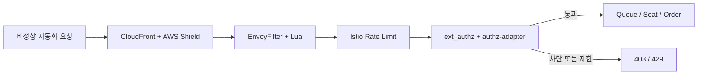

# 봇 대응 체계

티켓팅 서비스는 요청 급증, 반복 접근, 대기열 우회 시도를 함께 막아야 하므로 `WAF`, `Rate Limit`, `ext_authz`, `Admission Token` 검증을 연계해 운영합니다.

---

## 대응 계층

---

## 계층별 역할

| 계층 | 구성 | 역할 |
|---|---|---|
| **Edge** | CloudFront + AWS Shield Standard | 대규모 트래픽 흡수와 외부 진입점 통합 |
| **WAF** | EnvoyFilter + Lua | 웹 공격 패턴과 Bot Scanner 탐지, 403 차단 |
| **Gateway 제한** | Istio Rate Limit | 과도한 요청을 429로 제한 |
| **행동 판단** | ext_authz + authz-adapter + AI Defense | 민감 API에 추가 판단 적용 |
| **애플리케이션 검증** | Queue / Seat / Order 계층 | 대기열, Hold, 주문 흐름 재검증 |

---

## 제어 기준

### 1. Rate Limit

- Local Rate Limit은 기본 초당 `100`, IP별 초당 `50` 요청입니다.
- 경로별 Local Rate Limit은 `/auth/` 초당 `10`, `/payment/` 초당 `5`, `/signup` 초당 `3` 요청입니다.
- Global Rate Limit은 Redis 기준으로 IP 분당 `300`, `/auth/kakao/login` 분당 `10`, `/auth/signup` 분당 `5`, `/order/payment` 분당 `20`, `/seat/hold` 분당 `30` 요청입니다.
- 요청이 기준을 넘으면 서비스 내부까지 전달하지 않고 `429`로 종료합니다.

### 2. AI Defense 연동

- `authz-adapter`가 AI Defense 평가 결과를 받아 Gateway 판단에 반영합니다.
- ext_authz는 대기열 진입과 좌석 선점 계열 민감 경로에 적용합니다.
- ext_authz 장애 시에는 `failOpen: true`로 동작합니다.

### 3. 대기열 우회 방지

- 대기열 입장과 좌석 선점은 별도 토큰 검증 기준을 둡니다.
- `Admission Token`은 쿠키 기반으로 전달되고, Seat 진입 시 다시 확인합니다.
- 단순 요청 성공보다 정상 입장 경로를 거쳤는지 여부를 함께 확인합니다.

### 4. WAF 차단

- `EnvoyFilter + Lua`는 SQL Injection, XSS, Path Traversal, Command Injection, LDAP Injection, XXE, SSRF, Log4Shell, Header Injection, Bot Scanner 패턴을 검사합니다.
- 차단 모드는 `block`으로 운영합니다.
- staging 구성에는 반복 탐지 기반 자동 블랙리스트 등록 경로가 포함됩니다.

---

## 점검 항목

| 항목 | 확인 내용 |
|---|---|
| **429 증가** | 경로별 Rate Limit이 과도하게 발동하는지 |
| **403 증가** | WAF 또는 ext_authz 차단이 급증하는지 |
| **인증 실패율** | 비정상 로그인 또는 접근 시도가 늘어나는지 |
| **차단 IP 증가** | 특정 시간대와 대역에 집중되는지 |
| **대기열 우회 징후** | 정상 토큰 없이 진입하려는 요청이 반복되는지 |
