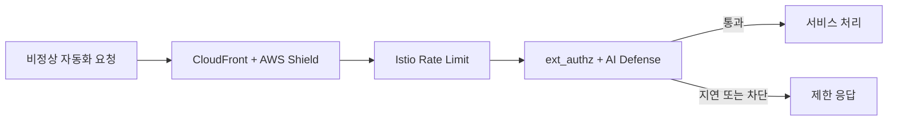

# 봇 대응 체계

티켓팅 서비스는 단시간에 요청이 몰리기 때문에, 봇 대응은 단순 차단보다 `과도한 요청 제한`, `행동 기반 판단`, `대기열 우회 방지`를 함께 보는 구조가 필요합니다.

---

## 대응 계층

---

## 계층별 역할

| 계층 | 구성 | 역할 |
|---|---|---|
| **Edge** | CloudFront + AWS Shield Standard | 대규모 트래픽 흡수와 외부 진입점 통합 |
| **Gateway 제한** | Istio Rate Limit | 과도한 요청을 429로 제한 |
| **행동 판단** | ext_authz + AI Defense | 민감 API에 추가 판단 적용 |
| **애플리케이션 검증** | Queue / Seat / Order 계층 | 대기열, Hold, 주문 흐름 재검증 |

---

## 운영 기준

### 1. Rate Limit

- 로그인, 회원가입, 결제, 좌석 선점처럼 영향이 큰 경로는 별도 제한을 둡니다.
- 요청이 기준을 넘으면 서비스 내부까지 전달하지 않고 429로 종료합니다.

### 2. AI Defense 연동

- AI Defense는 행동 패턴을 평가합니다.
- Istio는 `authz-adapter`를 통해 AI 판단 결과를 반영합니다.
- 민감 API는 ext_authz 대상 경로로 분리해 운영합니다.

### 3. 대기열 우회 방지

- 대기열 입장과 좌석 선점은 별도 토큰 검증 기준을 둡니다.
- `Admission Token`은 쿠키 기반으로 전달되고, Seat 진입 시 다시 확인합니다.
- 단순 요청 성공보다 `정상 절차를 거쳤는지`를 함께 봅니다.

---

## 운영자가 확인하는 지표

| 항목 | 확인 내용 |
|---|---|
| **429 증가** | 경로별 Rate Limit이 과도하게 발동하는지 |
| **403 증가** | 보안 필터 또는 ext_authz 차단이 급증하는지 |
| **인증 실패율** | 비정상 로그인 또는 접근 시도가 늘어나는지 |
| **WAF / 제한 이벤트** | Istio Gateway 차단 이벤트가 특정 시간대에 집중되는지 |
| **대기열 우회 징후** | 정상 토큰 없이 진입하려는 요청이 반복되는지 |
