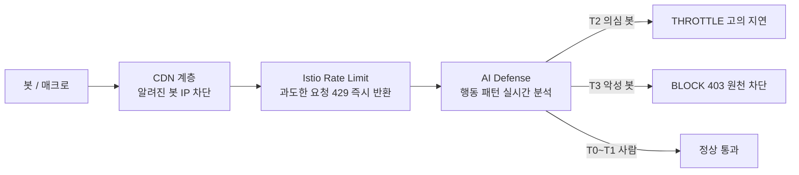

# 봇 대응 체계

단시간에 대규모 동시 접속이 몰리는 티켓팅 특성상, 자동화 봇과 매크로 대응이 서비스 공정성의 핵심입니다. 인프라 계층의 Rate Limiting과 AI 기반 행동 분석을 결합해 다층적으로 봇을 탐지하고 차단합니다.

---

## 봇 대응 계층 구조

---

## 계층별 봇 대응

### 1계층: CDN (CloudFront + AWS Shield)
- AWS Shield Standard로 대규모 인프라 레벨 DDoS 자동 완화
- CloudFront의 IP 평판 필터를 통해 알려진 악성 IP 사전 차단
- 비정상적으로 높은 요청 빈도의 IP를 자동 탐지하여 차단

### 2계층: Istio Rate Limiting
- 결제/예매 API에 보수적 요청 제한 적용 (429 Too Many Requests 즉시 반환)
- 동일 IP/세션의 단시간 과도 요청을 Ingress Gateway 수준에서 차단
- 정상 사용자 UX 보호를 위해 조회 API는 상대적으로 높은 허용치 유지

### 3계층: AI Defense (행동 기반 탐지)
AI 팀이 구축한 실시간 행동 분석 시스템과 연동합니다.

| 위험 티어 | 판단 기준 | 대응 |
|---|---|---|
| **T0~T1 (사람)** | 정상 마우스 궤적, 자연스러운 체류 시간 | 즉시 통과 |
| **T2 (의심 봇)** | 기계적으로 일정한 클릭 주기, 직선 궤적 | 고의적 응답 지연 (50~500ms) |
| **T3 (악성 봇)** | 완전 인위적 좌표 직행, 식별된 IP | Envoy 단 403 차단 |

---

## 모니터링 및 알람

보안 이벤트는 중앙 집중형 로그 시스템으로 수집되어 실시간으로 분석됩니다.

| 알람 조건 | 심각도 | 조치 |
|---|---|---|
| 특정 API 5xx 에러율 > 3% (5분) | Critical | Discord 즉시 알림 + 수동 조사 |
| 단일 IP 요청 수 임계치 초과 | Warning | 자동 Rate Limit 강화 |
| 알려진 봇 에이전트 헤더 탐지 | Info | 로그 기록 + 패턴 분석 |
| CloudTrail 이상 API 호출 탐지 | Critical | EventBridge → SNS → Discord |

---

## 대기열 우회 방지

티켓팅 서비스 특성상 대기열을 우회하는 봇 공격이 핵심 위협입니다. 백엔드팀과의 연계로 대기열 우회를 기술적으로 완벽히 차단합니다.

- **Admission Token**: 30초 TTL의 일회용 토큰으로 대기열 통과 증명. 복사/재사용 불가
- **Seat Hold 검증**: 좌석 선택 후 주문 생성 시 Hold 토큰 재검증
- **AI 사후 분석**: 대기열 통과 후에도 행동 데이터를 수집해 봇 패턴을 사후 분석하고 계정 제재
