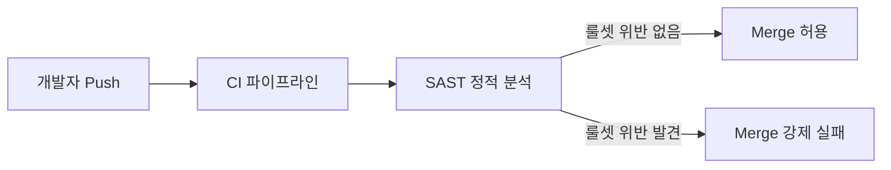

# 클라이언트 보안

프론트엔드 코드와 클라이언트 환경 자체를 보호합니다. JavaScript 코드 분석을 어렵게 만들어 API 구조 노출을 최소화하고, 자동화 공격 도구 제작을 방해합니다. 또한 CI 파이프라인에 정적 분석을 도입해 개발 단계부터 보안 취약점을 통제합니다.

---

## JavaScript 난독화 (Obfuscation)

### 목적
- 클라이언트 코드 분석 방지
- API 엔드포인트 및 파라미터 구조 노출 최소화
- 자동화 공격 도구(매크로/봇) 제작 난이도 향상

### 적용 방식

| 옵션 | 설명 |
|---|---|
| **compact** | 코드를 한 줄로 압축해 가독성 제거 |
| **string-array** | 문자열 리터럴을 배열 참조로 변환 |
| **base64 인코딩** | 문자열 배열을 Base64로 인코딩 |
| **변수/함수 이름 변환** | 의미 있는 식별자를 무작위 문자열로 치환 |
| **코드 흐름 난독화** | 제어 흐름(Control Flow)을 복잡하게 변환해 역분석 어렵게 만듦 |

---

## SAST (정적 소스 코드 분석)

CI 파이프라인에 SAST 도구를 도입해 코드 변경 시마다 자동으로 보안 취약점을 검열합니다.

### 주요 효과
- **개발 초기 단계 통제**: 코드 리뷰 이전에 기계적으로 보안 위협을 차단
- **Merge 게이트**: 룰셋을 위반하는 코드는 병합(Merge)이 강제로 실패
- **가이드라인 연동**: 정식 보안 가이드라인을 SAST 룰셋으로 등록해 자동 강제화

---

## 보안 가이드라인 정식화

제정된 보안 개발 가이드라인은 내부 기술 아키텍처 문서에 공식 지침으로 등록되어 모든 팀이 동일한 기준을 따릅니다.

- **인증/인가**: JWT 처리, 토큰 저장 위치, 만료 처리 가이드
- **API 설계**: 파라미터 검증, 에러 메시지 노출 방지
- **의존성 관리**: 취약한 npm 패키지 사용 금지 목록
