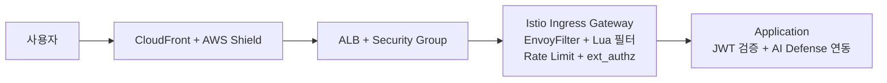

# 보안 흐름

외부 요청은 Edge, Ingress, 서비스 메시, 애플리케이션 계층을 순서대로 통과합니다. 각 계층은 같은 역할을 반복하지 않고, 서로 다른 지점에서 요청을 확인하고 제한합니다.

---

## 전체 보안 계층 구조

| 계층 | 구성 | 역할 | 상태 |
|---|---|---|---|
| **Edge** | CloudFront + AWS Shield Standard | 대규모 트래픽 흡수, 정적 캐시, 외부 진입점 통합 | ✅ 운영 |
| **Ingress** | ALB + Security Group | 외부 트래픽 수신, Ingress Gateway 전달 | ✅ 운영 |
| **Service Mesh** | Istio Ingress Gateway | L7 필터링, Rate Limit, ext_authz 연동, 내부 통신 암호화 | ✅ 운영 |
| **Application** | API Gateway, Auth-Guard, AI Defense | JWT 검증, 인증 흐름, 행동 기반 판단 | ✅ 운영 |

---

## 계층별 역할

### Edge 계층

- `CloudFront`가 외부 요청의 첫 진입점 역할을 합니다.
- 정적 자원은 캐시에서 우선 처리하고, API 요청은 원본으로 전달합니다.
- `AWS Shield Standard`는 기본 DDoS 방어 계층으로 동작합니다.

### Ingress 계층

- `ALB`가 Kubernetes 외부 진입점 역할을 수행합니다.
- Ingress Gateway는 `ClusterIP`로 두고, 외부 노출은 ALB를 기준으로 관리합니다.
- AWS 보안 그룹 정책으로 허용된 진입 경로만 유지합니다.

### Istio 계층

- `EnvoyFilter + Lua` 보안 필터가 웹 공격 패턴과 비정상 요청을 확인합니다.
- `Rate Limit`이 과도한 요청을 429로 제한합니다.
- `ext_authz`가 AI Defense 어댑터와 연동되어 일부 민감 API에 추가 판단을 적용합니다.
- 서비스 간 내부 통신은 `mTLS`를 기본으로 사용합니다.

### 애플리케이션 계층

- `Auth-Guard`가 JWT를 발급하고 갱신합니다.
- `API Gateway`와 각 서비스는 JWT와 내부 토큰을 기준으로 요청을 검증합니다.
- `AI Defense`는 행동 기반 판단 결과를 제공하고, 차단 또는 지연 정책과 연동됩니다.

---

## 운영 관점에서 보는 기준

| 구분 | 확인 기준 |
|---|---|
| **외부 진입** | CloudFront, ALB, Ingress Gateway 경로가 정상인지 |
| **차단/제한** | 403, 429, 인증 실패율, WAF 차단 이벤트가 증가하는지 |
| **내부 통신** | mTLS 정책과 예외 구성이 운영 상태와 일치하는지 |
| **인증 흐름** | JWT 발급, 검증, 쿠키 처리 흐름이 정상인지 |
| **봇 대응** | Rate Limit과 AI Defense 판단 결과가 서비스 영향 없이 동작하는지 |
