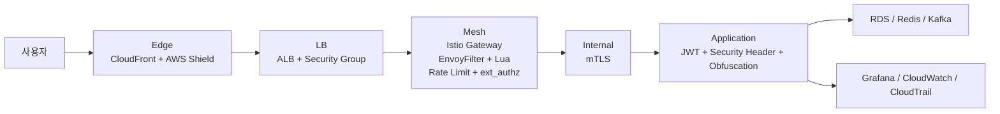

# 보안 흐름

Playball 보안 흐름은 외부망부터 애플리케이션까지 5계층 심층 방어를 기준으로 구성합니다. 엣지(CDN), LB(ALB), 메쉬(Istio WAF), 내부통신(mTLS), 애플리케이션(JWT·보안 헤더·난독화) 순서로 요청을 검증하고 차단합니다.

---

## 전체 요청 흐름

---

## 5계층 심층 방어

| 계층 | 주요 구성 | 처리 기준 |
|---|---|---|
| **Edge** | CloudFront, AWS Shield Standard | 외부 진입점 통합, 정적 캐시 처리, 대규모 트래픽 흡수 |
| **LB** | ALB, Security Group | 허용된 진입 경로만 유지하고 메쉬 계층으로 전달 |
| **Mesh** | Istio Gateway, EnvoyFilter + Lua, Rate Limit, ext_authz | 공격 패턴 차단, 과도한 요청 제한, 민감 경로 추가 검증 |
| **Internal** | Istio mTLS, Redis TLS(in-transit) | 서비스 간 통신 암호화와 상호 인증, ElastiCache Redis는 TLS(required)로 전 환경 강제 |
| **Application** | JWT, 보안 헤더, 난독화, Admission Token | 사용자 인증 상태와 토큰 유효성 확인, 대기열 우회와 비정상 선점 요청 방지 |

---

## 차단과 검증 기준

| 구분 | 적용 위치 | 목적 |
|---|---|---|
| **WAF 패턴 검사** | Mesh | SQL Injection, XSS, Path Traversal, SSRF, Log4Shell, Bot Scanner 등 차단 |
| **Rate Limit** | Mesh | 과도한 요청을 Gateway에서 429로 종료 |
| **추가 인가 판단** | Mesh | ext_authz + authz-adapter로 민감 경로 추가 검증 |
| **JWT 검증** | Application | 사용자 인증 상태와 토큰 유효성 확인 |
| **Admission Token 검증** | Application | 대기열 우회와 비정상 선점 요청 방지 |
| **보안 헤더 / 난독화** | Application | 브라우저 노출 범위 최소화 |
| **mTLS** | Internal | 내부 통신 암호화와 서비스 상호 인증 |
| **감사 추적** | CloudTrail, EventBridge | 운영 변경, 보안 이벤트, 예외 보관 판단 근거 확보 |

---

## 추적 경로

| 구분 | 확인 경로 |
|---|---|
| **차단 / 제한 이벤트** | Grafana, Loki, Istio 관련 대시보드 |
| **정책 위반 이벤트** | Policy Reporter, Discord |
| **운영 변경 이력** | CloudTrail, EventBridge, Discord |
| **복구 후 상태 확인** | Grafana, CloudWatch, Discord |

---

## 점검 항목

| 구분 | 확인 기준 |
|---|---|
| **외부 진입** | CloudFront, ALB, Gateway 경로가 정상인지 |
| **차단 / 제한** | 403, 429, 인증 실패율, WAF 차단 이벤트가 증가하는지 |
| **인가 흐름** | ext_authz, JWT, Admission Token 검증이 정상인지 |
| **내부 통신** | mTLS 정책과 예외 구성이 운영 기준과 일치하는지 |
| **클라이언트 보호** | 보안 헤더와 난독화 기준이 배포 상태와 일치하는지 |
| **감사 추적** | CloudTrail, EventBridge, Discord 흐름이 정상인지 |
