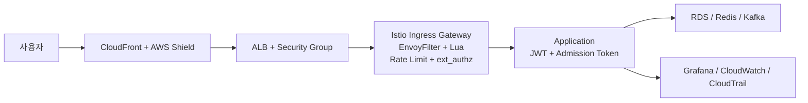

# 보안 흐름

Playball 요청은 Edge, Ingress, Gateway, 애플리케이션 계층을 순서대로 통과합니다. 외부 요청 차단과 제한은 Gateway에서 먼저 처리하고, 인증과 토큰 검증은 애플리케이션 계층에서 이어집니다. 운영 변경과 보안 이벤트는 CloudTrail, EventBridge, Discord 기준으로 추적합니다.

---

## 전체 요청 흐름

---

## 계층별 처리 흐름

| 계층 | 주요 구성 | 처리 기준 |
|---|---|---|
| **Edge** | CloudFront, AWS Shield Standard | 외부 진입점 통합, 정적 캐시 처리, 대규모 트래픽 흡수 |
| **Ingress** | ALB, Security Group | 허용된 진입 경로만 유지하고 Gateway로 전달 |
| **Gateway** | Istio Ingress Gateway, EnvoyFilter + Lua, Rate Limit, ext_authz | 공격 패턴 차단, 과도한 요청 제한, 민감 경로 추가 검증 |
| **Application** | Auth-Guard, API Gateway, Queue, Seat, Order | JWT 검증, Refresh Token 처리, Admission Token 재검증 |
| **Internal** | Istio mTLS, IRSA, RBAC | 서비스 간 통신 보호, 권한 분리, 운영 접근 제어 |
| **Audit** | CloudTrail, EventBridge, Lambda, Discord | 운영 변경 이력과 보안 이벤트 추적 |

---

## 차단과 검증 기준

| 구분 | 적용 위치 | 목적 |
|---|---|---|
| **WAF 패턴 검사** | Istio Gateway | SQL Injection, XSS, Path Traversal, SSRF, Log4Shell, Bot Scanner 등 차단 |
| **Rate Limit** | Istio Gateway | 과도한 요청을 Gateway에서 429로 종료 |
| **추가 인가 판단** | ext_authz + authz-adapter | 대기열 진입, 좌석 선점 계열 민감 경로 추가 검증 |
| **JWT 검증** | Auth-Guard, API, Gateway 계층 | 사용자 인증 상태와 토큰 유효성 확인 |
| **Admission Token 검증** | Queue, Seat 계열 | 대기열 우회와 비정상 선점 요청 방지 |
| **mTLS** | 서비스 간 통신 | 내부 통신 암호화와 서비스 상호 인증 |
| **감사 추적** | CloudTrail, EventBridge | 운영 변경, 보안 이벤트, 예외 보관 판단 근거 확보 |

---

## 추적 경로

| 구분 | 확인 경로 |
|---|---|
| **차단 / 제한 이벤트** | Grafana, Loki, Istio 관련 대시보드 |
| **정책 위반 이벤트** | Policy Reporter, Discord |
| **운영 변경 이력** | CloudTrail, EventBridge, Discord |
| **복구 후 상태 확인** | Grafana, CloudWatch, Discord |

---

## 점검 항목

| 구분 | 확인 기준 |
|---|---|
| **외부 진입** | CloudFront, ALB, Gateway 경로가 정상인지 |
| **차단 / 제한** | 403, 429, 인증 실패율, WAF 차단 이벤트가 증가하는지 |
| **인가 흐름** | ext_authz, JWT, Admission Token 검증이 정상인지 |
| **내부 통신** | mTLS 정책과 예외 구성이 운영 상태와 일치하는지 |
| **감사 추적** | CloudTrail, EventBridge, Discord 흐름이 정상인지 |
