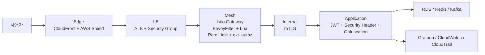

# 보안 흐름

Playball 보안 흐름은 **프론트부터 운영자까지 7축 보안 체계**를 기준으로 구성합니다. 클라이언트(CSP·X-Bot-Token), Gateway/mTLS(CDN·ALB·Istio WAF), 봇 대응(Fingerprint·AI Defense), 백엔드(JWT·Admission Token·보안 헤더), 데이터(암호화·DB Role·Secrets), 인프라(NetworkPolicy·런타임 감시·Kyverno), 접근 제어(IAM SSO) 7개 축에서 단계별로 요청을 검증하고 차단합니다.

---

## 전체 요청 흐름

---

## 7축 보안 체계

| 축 | 주요 구성 | 처리 기준 |
|---|---|---|
| **클라이언트** | CSP, X-Bot-Token(Canvas FP+HMAC), 보안 헤더, 소스맵 비활성화, 난독화 | 브라우저 노출 최소화, 프론트에서 방어 토큰 발행 |
| **Gateway / mTLS** | CloudFront, ALB+SG, Istio Gateway, EnvoyFilter+Lua, Rate Limit, ext_authz | 외부 진입 통합 · 요청 패턴 차단 · 서비스 간 통신 암호화 |
| **봇 대응** | Fingerprint 추적, bot_fingerprint_headless/multi_ip 메트릭, AI Defense 행동 분석 | 헤드리스·분산 매크로·AI 에이전트 탐지 |
| **백엔드** | JWT 검증, Admission Token 재검증, 보안 헤더 | 앱 계층 최종 방어 · 대기열 우회 차단 |
| **데이터** | RDS PITR·저장 암호화·TLS required, Secrets Manager 환경별 격리 | DB/Redis 접속 안전성 · 시크릿 노출 최소화 |
| **인프라** | NetworkPolicy(default-deny), 런타임 감시, Kyverno + Policy Reporter | 네트워크 격리 · 컨테이너 런타임 감시 · 배포 리소스 정책 |
| **접근 제어** | IAM Identity Center SSO, 최소 권한 Permission Set, CloudTrail 감사 | 운영자 접근 · 변경 이력 추적 |

---

## 차단과 검증 기준

| 구분 | 적용 위치 | 목적 |
|---|---|---|
| **WAF 패턴 검사** | Mesh | SQL Injection, XSS, Path Traversal, SSRF, Log4Shell, Bot Scanner 등 차단 |
| **Rate Limit** | Mesh | 과도한 요청을 Gateway에서 429로 종료 |
| **추가 인가 판단** | Mesh | ext_authz + authz-adapter로 민감 경로 추가 검증 |
| **JWT 검증** | Application | 사용자 인증 상태와 토큰 유효성 확인 |
| **Admission Token 검증** | Application | 대기열 우회와 비정상 선점 요청 방지 |
| **보안 헤더 / 난독화** | Application | 브라우저 노출 범위 최소화 |
| **mTLS** | Internal | 내부 통신 암호화와 서비스 상호 인증 |
| **감사 추적** | CloudTrail, EventBridge | 운영 변경, 보안 이벤트, 예외 보관 판단 근거 확보 |

---

## 추적 경로

| 구분 | 확인 경로 |
|---|---|
| **차단 / 제한 이벤트** | Grafana, Loki, Istio 관련 대시보드 |
| **정책 위반 이벤트** | Policy Reporter, Discord |
| **운영 변경 이력** | CloudTrail, EventBridge, Discord |
| **복구 후 상태 확인** | Grafana, CloudWatch, Discord |

---

## 점검 항목

| 구분 | 확인 기준 |
|---|---|
| **외부 진입** | CloudFront, ALB, Gateway 경로가 정상인지 |
| **차단 / 제한** | 403, 429, 인증 실패율, WAF 차단 이벤트가 증가하는지 |
| **인가 흐름** | ext_authz, JWT, Admission Token 검증이 정상인지 |
| **내부 통신** | mTLS 정책과 예외 구성이 운영 기준과 일치하는지 |
| **클라이언트 보호** | 보안 헤더와 난독화 기준이 배포 상태와 일치하는지 |
| **감사 추적** | CloudTrail, EventBridge, Discord 흐름이 정상인지 |
