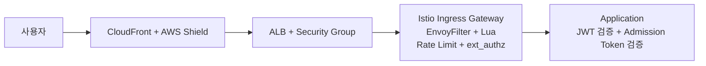

# 보안 흐름

외부 요청은 Edge, ALB, Istio Ingress Gateway, 애플리케이션 계층을 순서대로 통과합니다. 차단과 제한은 Gateway에서 먼저 처리하고, 인증과 토큰 검증은 애플리케이션 계층에서 이어집니다.

---

## 전체 보안 계층 구조

| 계층 | 구성 | 역할 |
|---|---|---|
| **Edge** | CloudFront + AWS Shield Standard | 대규모 트래픽 흡수, 정적 캐시, 외부 진입점 통합 |
| **Ingress** | ALB + Security Group | 외부 트래픽 수신, Ingress Gateway 전달 |
| **Service Mesh** | Istio Ingress Gateway | EnvoyFilter + Lua 검사, Rate Limit, ext_authz 연동, 내부 통신 암호화 |
| **Application** | API Gateway, Auth-Guard, Queue, Seat, Order | JWT 검증, Refresh Token 처리, Admission Token 검증 |

---

## 계층별 역할

### Edge 계층

- `CloudFront`가 외부 요청의 첫 진입점 역할을 합니다.
- 정적 자원은 캐시에서 우선 처리하고, API 요청은 원본으로 전달합니다.
- `AWS Shield Standard`는 기본 DDoS 방어 계층으로 동작합니다.

### Ingress 계층

- `ALB`가 Kubernetes 외부 진입점 역할을 수행합니다.
- Ingress Gateway는 `ClusterIP`로 두고, 외부 노출은 ALB를 기준으로 관리합니다.
- AWS 보안 그룹 정책으로 허용된 진입 경로만 유지합니다.

### Istio 계층

- `EnvoyFilter + Lua`가 SQL Injection, XSS, Path Traversal, Command Injection, SSRF, Log4Shell, Bot Scanner 패턴을 검사합니다.
- 차단 모드는 `block`으로 운영하고, 차단 응답은 `403`을 반환합니다.
- 외부 접근이 필요 없는 health, metrics, actuator, swagger 계열 경로는 접두사 기준으로 별도 차단합니다.
- `Local Rate Limit`과 `Global Rate Limit`이 과도한 요청을 `429`로 제한합니다.
- `ext_authz`는 `authz-adapter`와 gRPC로 연결되며, 대기열 진입과 좌석 선점 계열 민감 경로를 대상으로 적용합니다.
- 서비스 간 내부 통신은 `mTLS`를 기본으로 사용합니다.

### 애플리케이션 계층

- `Auth-Guard`가 JWT를 발급하고 갱신합니다.
- `API Gateway`와 각 서비스는 JWT를 기준으로 요청을 검증합니다.
- `Queue`, `Seat` 흐름은 `Admission Token` 쿠키를 사용해 대기열 우회 여부를 다시 확인합니다.
- `authz-adapter`는 AI Defense 평가 결과를 받아 Gateway 판단에 반영합니다.

---

## 보안 이벤트 전파

| 구분 | 전파 경로 | 채널 |
|---|---|
| **EKS 내부 보안 이벤트** | Prometheus/Loki → Alertmanager → Discord | `#alerts-security-warning`, `#alerts-security-critical` |
| **AWS 감사/보안 이벤트** | CloudTrail/EventBridge → Lambda → Discord | `#alerts-security-warning`, `#alerts-security-critical` |
| **사후 추적** | CloudTrail S3 적재 → Athena 조회 | 수동 조사 |

---

## 점검 항목

| 구분 | 확인 기준 |
|---|---|
| **외부 진입** | CloudFront, ALB, Ingress Gateway 경로가 정상인지 |
| **차단/제한** | 403, 429, 인증 실패율, WAF 차단 이벤트가 증가하는지 |
| **내부 통신** | mTLS 정책과 예외 구성이 운영 상태와 일치하는지 |
| **인증 흐름** | JWT 발급, 검증, 쿠키 처리 흐름이 정상인지 |
| **감사 추적** | CloudTrail 이벤트와 EventBridge 보안 이벤트가 수집되는지 |
