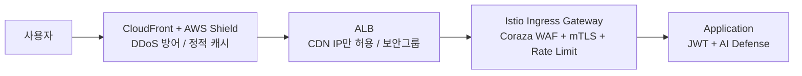

# 보안 흐름

외부에서 내부 서비스까지 모든 트래픽은 4개의 보안 계층을 순서대로 통과합니다. 각 계층은 서로 다른 위협을 전담하며, 단일 장비의 실패가 전체 시스템 붕괴로 이어지지 않는 심층 방어(Defense in Depth) 구조를 형성합니다.

---

## 전체 보안 계층 구조

| 계층 | 도구 | 역할 | 상태 |
|---|---|---|---|
| **CDN / Edge** | CloudFront + AWS Shield | DDoS 방어, Origin IP 숨김, 정적 자원 캐시 | ✅ 완료 |
| **NLB / ALB** | AWS ALB + Security Group | CDN IP만 허용, 외부 직접 접근 차단 | ✅ 완료 |
| **Istio Gateway** | Coraza WAF + mTLS + Rate Limit | WAF, 서비스 간 암호화, 과도한 요청 제한 | ✅ 완료 |
| **애플리케이션** | JWT + AI Defense | 인증/인가, 행동 기반 봇 탐지 | 🔧 개발 중 |

---

## 각 계층 상세

### CDN / Edge 계층 (1차 방어선)
전 세계에 분산된 CloudFront 인프라로 모든 요청을 수용합니다. AWS의 물리적 글로벌 대역폭으로 DDoS를 효과적으로 완화하고, Origin 서버의 실제 IP를 숨겨 직접 공격을 원천 차단합니다. 정적 자원(이미지, 빌드 파일 등)은 오리진 서버 도달 전 CDN 캐시에서 반환해 백엔드 부하를 절감합니다.

### ALB / 보안 그룹 (2차 방어선)
CloudFront를 우회한 직접 접근을 차단합니다. 보안 그룹에 CloudFront 전용 Managed Prefix List를 강제 참조하도록 설정해, 인가되지 않은 외부 IP의 직접 접근을 완전 거부(Drop)합니다.

### Istio Ingress Gateway (3차 방어선)
외부망을 통과한 트래픽에 대해 세 가지 제어를 수행합니다.

- **Coraza WAF**: SQL Injection, XSS 등 웹 공격 차단 (자체 구현, AWS WAF 대비 비용 $0)
- **Rate Limiting**: 좌석 조회는 높은 허용치로 가용성 보장, 결제/예매는 보수적 제한으로 429 즉시 반환
- **mTLS**: 서비스 간 내부 통신 전체를 상호 인증 + 암호화

### 애플리케이션 계층 (4차 방어선)
- **JWT 검증**: API Gateway에서 RSA-256 서명 기반 중앙 검증
- **AI Defense**: 행동 기반 실시간 봇 탐지 및 차단
