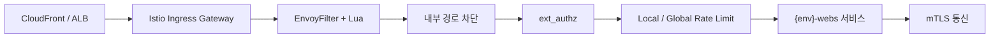

# Gateway / mTLS

> **역할**: 외부 진입 차단 · 서비스 메쉬 보안의 중심

Playball은 외부 요청을 Istio Gateway에서 먼저 제한하고, 서비스 간 통신은 Istio mTLS로 보호합니다. Gateway에는 EnvoyFilter + Lua, 내부 경로 차단, ext_authz, Rate Limit을 적용하고, mesh 내부는 `STRICT` mTLS를 기본으로 유지합니다.

---

## Gateway 처리 구조

---

## Gateway 운영 기준

| 항목 | 적용 방식 | 현재 기준 |
|---|---|---|
| **EnvoyFilter + Lua** | 비정상 요청 패턴 검사 후 Gateway에서 차단 | SQL Injection, XSS, Path Traversal, Command Injection, LDAP Injection, XXE, SSRF, Log4Shell, Header Injection, Bot Scanner 검사 |
| **차단 응답** | 보안 필터 매칭 시 즉시 종료 | `block` 모드, `403` 응답 |
| **내부 경로 차단** | 외부로 노출하지 않는 health, metrics, actuator 계열 경로 차단 | `/api/prometheus*`, `/metrics*`, `/health*`, `/actuator/health*` 등 접두사 기준 차단 |
| **ext_authz** | 좌석·대기열 API를 `authz-adapter`로 재검증 | gRPC `9001`, `failOpen: true`, 대기열 진입·좌석 조회·좌석 hold 계열 경로 적용 |
| **Local Rate Limit** | Gateway 단에서 초당 요청 수 제한 | 기본 `100 req/s`, IP 기준 `50 req/s`, `/auth/` `10 req/s`, `/payment/` `5 req/s`, `/signup` `3 req/s` |
| **Global Rate Limit** | Redis 기반 분당 요청 수 제한 | IP 기준 `300 req/min`, `/auth/kakao/login` `10/min`, `/auth/signup` `5/min`, `/order/payment` `20/min`, `/seat/hold` `30/min` |

---

## mTLS 운영 기준

| 항목 | 운영 기준 |
|---|---|
| **기본 모드** | 서비스 간 통신은 `STRICT` 기준으로 운영 |
| **적용 네임스페이스** | `{env}-webs`, `monitoring` |
| **인증서 관리** | `Istiod`가 Sidecar 인증서를 배포하고 자동 갱신 |
| **기본 효과** | 서비스 간 상호 인증과 내부 통신 암호화 |

### mTLS 예외 허용 — 운영 필요성에 의한 의도된 예외

| 구분 | 대상 | 이유 |
|---|---|---|
| **non-mesh 서비스** | `messaging`, `data` | Sidecar 없는 외부·레거시 서비스와 통신 → PLAINTEXT 허용 |
| **메트릭 스크랩** | `{env}-webs` 앱 관리 포트 `9090` | Prometheus 스크랩 경로 예외 |
| **OTEL 수집** | `monitoring`의 OpenTelemetry Collector | plain HTTP 수집 허용 |
| **AI 메트릭** | `{env}-ai`의 `ai-defense`, `authz-adapter` 메트릭 포트 | 메트릭 엔드포인트 예외 |

---

## 적용 제외 및 예외

| 구분 | 대상 | 이유 |
|---|---|---|
| **WAF 제외** | Grafana 내부 API, health, metrics, swagger, OAuth callback | 내부 대시보드 조회와 운영성 경로 오탐 방지 |
| **ext_authz 제외** | `/ai/`, health, metrics, actuator 계열 | AI 직접 호출 경로와 운영성 경로 분리 |
| **Rate Limit 제외** | health, metrics, actuator health | 상태 확인 경로에 제한이 걸리지 않도록 유지 |
| **mTLS 예외** | `messaging`, `data`, 앱 관리 포트 `9090`, OTEL Collector, AI 메트릭 포트 | non-mesh 서비스 연동과 메트릭 수집 유지 |

---

## 운영 확인

| 항목 | 확인 경로 |
|---|---|
| **Gateway 차단 이벤트** | Grafana 보안 대시보드, Loki Ingress 로그 |
| **Rate Limit 동작** | Grafana 보안 대시보드, Istio 프록시 로그 |
| **ext_authz 상태** | Grafana, authz-adapter 메트릭, Discord 알림 |
| **mTLS 예외 적용** | Grafana 서비스 메트릭, Prometheus 스크랩 상태 |

---

## 점검 항목

| 항목 | 확인 내용 |
|---|---|
| **Gateway 필터 동작** | `403` 차단, 필터 매칭 패턴, 비정상 요청 급증 여부 |
| **Rate Limit 상태** | `429` 증가, 경로별 제한 동작 여부 |
| **ext_authz 상태** | `authz-adapter` 연결, 응답 지연, fail-open 발생 여부 |
| **mTLS 상태** | `STRICT` 정책과 예외 포트 구성이 적용되었는지 |
| **메트릭 수집 예외** | Prometheus 스크랩과 OTEL 수집이 정상 동작하는지 |
