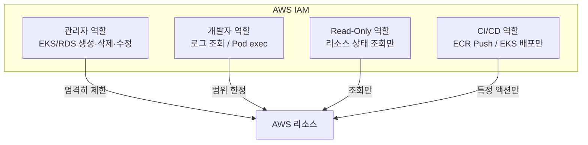

# IAM 접근 제어

운영 클라우드 환경의 접근 권한을 세분화하여 관리합니다. 관리 계정 탈취나 권한 남용이 전체 서비스 붕괴(SPOF)로 번지지 않도록 RBAC(역할 기반 접근 제어) 모델을 설계했습니다.

---

## 최소 권한 원칙 (Principle of Least Privilege)

광범위한 자원 허용 정책을 배제하고, 역할별로 필요한 최소 권한만 부여합니다.

---

## 역할별 권한 설계

| 역할 | 허용 권한 | 제한 이유 |
|---|---|---|
| **관리자** | EKS, RDS, Redis 생성/수정/삭제 | 최소 인원에게만 부여, MFA 강제 |
| **개발자** | CloudWatch 로그 조회, kubectl exec (제한된 네임스페이스) | 운영 데이터 직접 접근 차단 |
| **Read-Only** | 리소스 상태 조회만 | 변경 작업 불가 |
| **CI/CD** | ECR 이미지 Push, EKS 특정 Deployment 업데이트만 | 파이프라인 전용 최소 권한 |

---

## 접근 제어 정책

### MFA (다중 인증) 강제화
관리자 역할과 AWS 콘솔 접근 시 MFA를 필수로 요구합니다. MFA 없이 접근을 시도하면 Deny 정책이 먼저 적용됩니다.

### 자격증명 자동 순환
- EC2/EKS 서비스용 자격증명: IAM Role for Service Account(IRSA)로 임시 토큰 자동 발급
- 장기 Access Key 사용 금지
- 키 유출 시 즉시 폐기 가능한 토큰 기반 인증 채택

### 접근 이력 감사
- **CloudTrail**: 모든 AWS API 호출을 S3에 기록
- **보관 기간**: 일반 감사 로그 400일, 개인정보처리시스템 접속 기록 2년
- **EventBridge + SNS**: 이상 접근 탐지 시 Discord 즉시 알림

---

## Kubernetes RBAC

EKS 클러스터 내부에서도 Kubernetes RBAC로 네임스페이스별 접근을 제한합니다.

| 주체 | 권한 범위 |
|---|---|
| **배포 서비스 계정** | 특정 네임스페이스의 Deployment 업데이트만 |
| **모니터링 에이전트** | 전 네임스페이스 Pod/Node 메트릭 읽기만 |
| **개발자 계정** | 지정 네임스페이스 로그 조회, exec 허용 |
