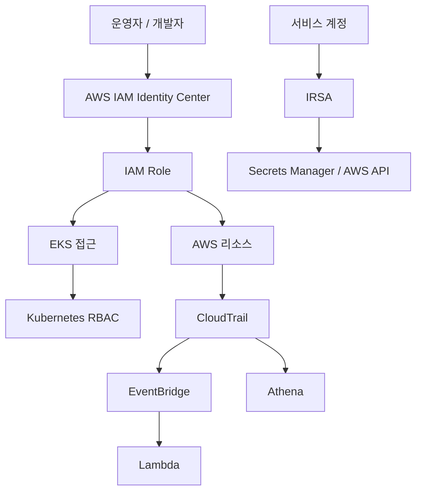

# 접근 제어

운영 접근은 `AWS IAM Identity Center SSO`, `IAM Role`, `IRSA`, `Kubernetes RBAC`를 함께 사용합니다. 사람 계정의 AWS Console/CLI 접근은 SSO 로그인과 Role 전환을 기준으로 처리합니다.

---

## 접근 제어 구조

---

## 권한 분리 기준

| 주체 | 사용 권한 | 분리 목적 |
|---|---|---|
| **운영자** | 환경 관리, 배포 확인, 장애 대응 | 운영 변경 책임 분리 |
| **개발자** | 제한된 조회와 개발 지원 작업 | 운영 리소스 직접 변경 최소화 |
| **CI/CD** | 이미지 반영과 배포 자동화 범위 | 자동화 계정의 권한 범위 고정 |
| **워크로드** | 필요한 AWS API만 사용 | 장기 Access Key 없이 서비스별 최소 권한 부여 |

---

## 사람 계정 접근

- 사람 계정은 `AWS IAM Identity Center SSO` 기반으로 접근합니다.
- 관리자성 작업은 별도 Role 전환을 통해 수행합니다.
- 운영 접근에는 `MFA`를 기본 요구사항으로 둡니다.
- 접근 기록은 CloudTrail과 별도 감사 로그 경로에 남깁니다.

---

## 워크로드 접근

- 클러스터 내부 워크로드는 `IRSA`를 기준으로 AWS 권한을 부여합니다.
- `External Secrets Operator`, `External DNS`, `AWS Load Balancer Controller`, `Karpenter`, `Grafana CloudWatch`, `RDS Backup`, `AI Defense` 등은 각각 필요한 Role만 사용합니다.
- 시크릿은 장기 Access Key 대신 Secrets Manager와 IRSA 조합으로 주입합니다.

---

## 클러스터 내부 권한

Kubernetes 내부 권한은 RBAC로 분리합니다.

| 대상 | 권한 범위 |
|---|---|
| **배포 계정** | 지정된 네임스페이스 배포 작업 |
| **모니터링 구성요소** | 메트릭과 리소스 조회 |
| **개발/운영 사용자** | 허용된 네임스페이스 기준 조회 또는 제한적 작업 |

---

## 감사와 추적

| 항목 | 운영 방식 |
|---|---|
| **AWS API 추적** | CloudTrail |
| **실시간 이벤트 전파** | EventBridge → Lambda → Discord |
| **일반 감사로그 보관** | 총 400일 |
| **개인정보처리시스템 접속기록** | 총 2년 |
| **감사 저장소 보호** | Versioning, HTTPS 강제, 무결성 검증 |

---

## 추적 대상 예시

| 항목 | 확인 방식 |
|---|---|
| **권한 변경** | IAM 정책, Role, Access Key 관련 CloudTrail 이벤트 확인 |
| **Route53 변경** | `ChangeResourceRecordSets` 이벤트와 호출 주체 확인 |
| **보안그룹/리소스 설정 변경** | EventBridge 보안 이벤트와 CloudTrail 원본 대조 |
| **사후 조사** | Athena에서 CloudTrail S3 로그 조회 |
