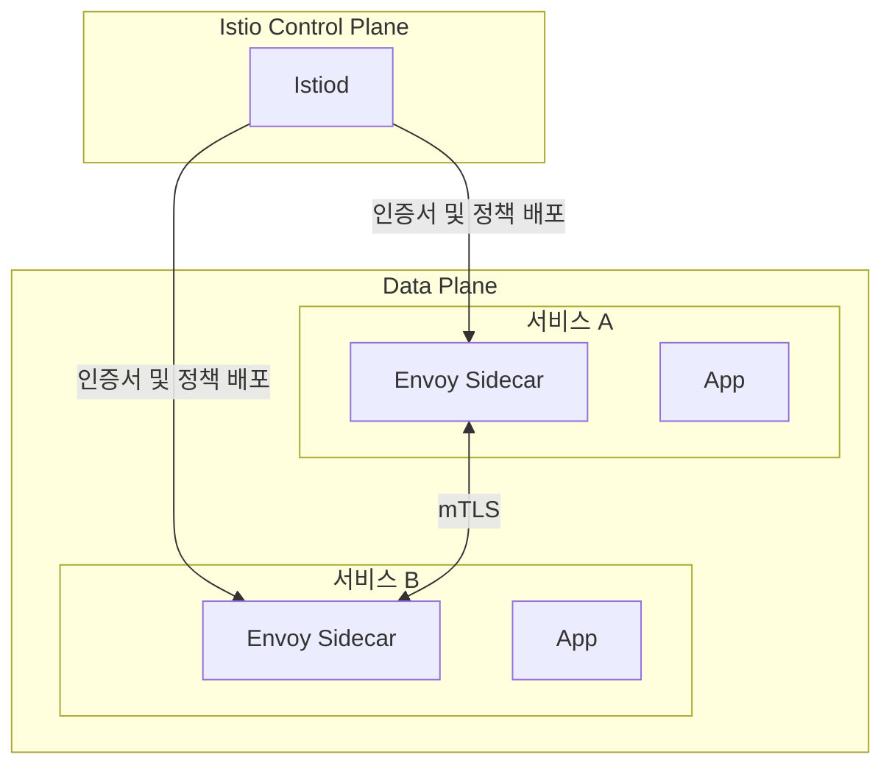

# Istio / mTLS

Istio는 외부 요청과 내부 서비스 통신 사이에서 공통 보안 기능을 처리합니다. 외부 요청은 Ingress Gateway에서 먼저 확인하고, 내부 서비스 통신은 mTLS를 기준으로 보호합니다.

---

## 서비스 메시 구조

---

## mTLS 운영 방식

| 항목 | 운영 기준 |
|---|---|
| **기본 모드** | 서비스 간 통신은 `STRICT` 기준으로 운영 |
| **인증서 관리** | Istiod가 Sidecar에 인증서를 배포하고 자동 갱신 |
| **기본 효과** | 서비스 간 상호 인증과 내부 통신 암호화 |
| **예외 처리** | 모니터링 스크랩, non-mesh 서비스, 일부 AI 서비스 메트릭 포트는 예외 허용 |

운영 환경에서는 모든 트래픽을 무조건 암호화하는 것이 아니라, `메시 내부 통신`과 `예외가 필요한 포트`를 구분해 관리합니다. 예를 들어 Prometheus 스크랩 포트나 sidecar가 없는 서비스는 별도 예외 구성이 필요합니다.

---

## Ingress Gateway 보안 기능

### EnvoyFilter + Lua 보안 필터

- SQL Injection, XSS, Path Traversal, Command Injection 등 주요 패턴을 검사합니다.
- detect와 block 모드를 구분해 운영할 수 있습니다.
- 보안 이벤트는 Istio 프록시 로그와 보안 대시보드에서 확인합니다.

### ext_authz 연동

- Istio는 `authz-adapter`와 gRPC로 연동합니다.
- 민감 API에 대해 AI Defense 판단을 추가로 반영합니다.
- AI 계층 장애 시에는 운영 영향 최소화를 위해 fail-open 기준을 적용합니다.

### Rate Limit

- 과도한 요청은 Gateway에서 먼저 제한합니다.
- 인증, 회원가입, 결제, 좌석 선점처럼 영향이 큰 경로는 별도 제한을 둡니다.
- 429 응답은 서비스 내부까지 요청을 넘기지 않고 Gateway에서 종료합니다.

---

## 운영자가 주로 확인하는 항목

| 항목 | 확인 내용 |
|---|---|
| **mTLS 상태** | STRICT 정책과 예외 포트 구성이 의도대로 적용되었는지 |
| **보안 필터 로그** | 403 차단, 필터 매칭 패턴, 비정상 요청 급증 여부 |
| **Rate Limit 상태** | 429 증가, 경로별 제한 동작 여부 |
| **ext_authz 상태** | authz-adapter 연결, AI 판단 지연, fail-open 발생 여부 |
| **메트릭 수집 예외** | Prometheus 스크랩 포트가 정상 노출되는지 |
