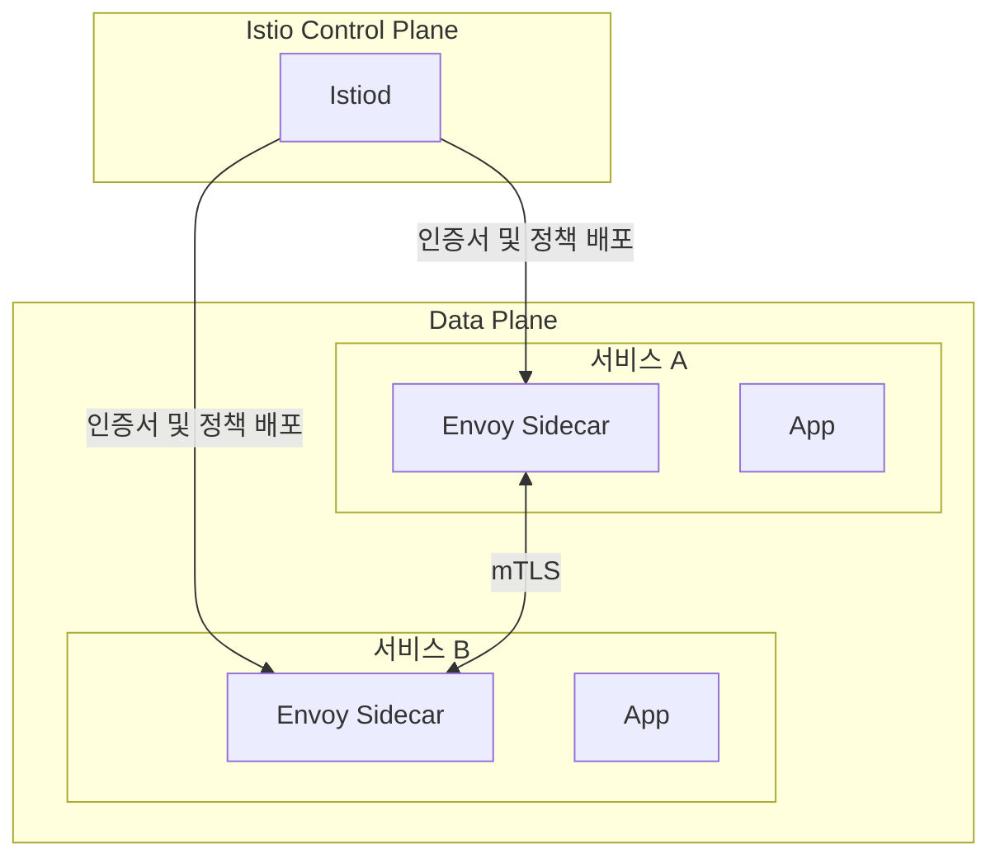

# Gateway / mTLS

Istio는 외부 요청 검사와 내부 서비스 통신 보호를 함께 처리합니다. Ingress Gateway는 차단과 제한을 먼저 수행하고, 서비스 간 통신은 `STRICT` mTLS를 기준으로 운영합니다.

---

## 서비스 메시 구조

---

## mTLS 운영 방식

| 항목 | 운영 기준 |
|---|---|
| **기본 모드** | 서비스 간 통신은 `STRICT` 기준으로 운영 |
| **인증서 관리** | Istiod가 Sidecar에 인증서를 배포하고 자동 갱신 |
| **기본 효과** | 서비스 간 상호 인증과 내부 통신 암호화 |
| **예외 처리** | non-mesh 네임스페이스, Prometheus 스크랩 포트, AI 메트릭 포트는 예외 허용 |

예외 대상에는 `messaging`, `data` 네임스페이스 같은 non-mesh 서비스와 `monitoring`의 스크랩, `staging-ai/prod-ai` 메트릭 포트가 포함됩니다.

---

## Ingress Gateway 보안 기능

### EnvoyFilter + Lua 보안 필터

- SQL Injection, XSS, Path Traversal, Command Injection 등 주요 패턴을 검사합니다.
- Log4Shell, LDAP Injection, XXE, SSRF, Header Injection, Bot Scanner 패턴도 함께 검사합니다.
- `block` 모드로 운영하며 차단 응답은 `403`입니다.
- 보안 이벤트는 Istio 프록시 로그와 보안 대시보드에서 확인합니다.

### ext_authz 연동

- Istio는 `authz-adapter`와 gRPC `9001` 포트로 연동합니다.
- 대상 경로는 `POST /queue/matches/{id}/enter`, `GET /seat/matches/{id}/recommendations/blocks`, `POST /seat/matches/{id}/recommendations/blocks/{id}/assign`, `GET /seat/matches/{id}/seat-groups`, `GET /seat/matches/{id}/sections/{id}/blocks`, `POST /seat/matches/{id}/seat-holds` 입니다.
- AI 계층 장애 시에는 `failOpen: true`로 동작합니다.

### Rate Limit

- 기본 Local Rate Limit은 초당 `100` 요청, IP별 기준은 초당 `50` 요청입니다.
- 경로별 Local Rate Limit은 `/auth/` 초당 `10`, `/payment/` 초당 `5`, `/signup` 초당 `3` 요청입니다.
- Global Rate Limit은 Redis 기반으로 운영하며, IP 기준 분당 `300`, `/auth/kakao/login` 분당 `10`, `/auth/signup` 분당 `5`, `/order/payment` 분당 `20`, `/seat/hold` 분당 `30` 요청 제한을 둡니다.
- 429 응답은 서비스 내부까지 요청을 넘기지 않고 Gateway에서 종료합니다.

---

## 적용 제외 경로

| 구분 | 경로 |
|---|---|
| **WAF 제외** | `/load-test/`, `/faro/`, `/api/datasources/`, `/socket.io/`, `/assets/`, `/explore`, `/api/ds/query`, health, metrics, swagger, OAuth callback |
| **ext_authz 제외** | `/ai/`, `/load-test/`, health, metrics, actuator |
| **Rate Limit 제외** | `/load-test/`, health, metrics, actuator health |

---

## 점검 항목

| 항목 | 확인 내용 |
|---|---|
| **mTLS 상태** | STRICT 정책과 예외 포트 구성이 적용되었는지 |
| **보안 필터 로그** | 403 차단, 필터 매칭 패턴, 비정상 요청 급증 여부 |
| **Rate Limit 상태** | 429 증가, 경로별 제한 동작 여부 |
| **ext_authz 상태** | authz-adapter 연결, 응답 지연, fail-open 발생 여부 |
| **메트릭 수집 예외** | Prometheus 스크랩 포트가 정상 노출되는지 |
