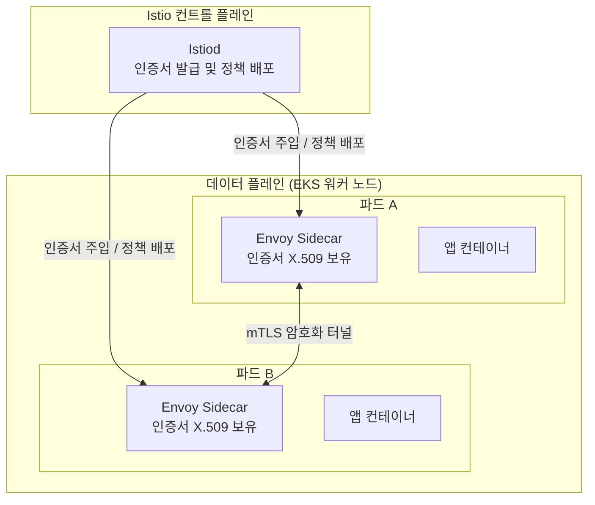

# Istio / mTLS

Istio 서비스 메시를 활용해 서비스 간 내부 통신 전체에 Zero Trust 보안 관계를 구현합니다. 외부에서 인증된 요청이라도 내부 서비스 간에는 서로를 암호화된 채널과 인증서로 다시 검증합니다.

---

## Zero Trust 내부 통신 구조

Istio Sidecar Proxy(Envoy)가 각 Pod에 주입되어 애플리케이션 코드가 보안 로직을 직접 다루지 않아도 됩니다. Istiod(Control Plane)가 실시간으로 인증서를 갱신·배포하고, 각 프록시가 이를 적용합니다.

---

## mTLS 동작 원리

| 단계 | 동작 |
|---|---|
| **1. 인증서 발급** | Istiod가 각 Pod의 Sidecar에 X.509 인증서를 실시간으로 주입 |
| **2. 상호 인증** | 두 서비스가 서로의 인증서를 교차 검증해 신뢰 확인 |
| **3. 암호화 통신** | 검증 완료 후 TLS 암호화 채널로 데이터 전송 |
| **4. 자동 갱신** | Istiod가 인증서 만료 전 자동 교체, 운영자 개입 불필요 |

---

## Rate Limiting 정책

과도한 세션 점유나 비정상 호출을 Ingress Gateway 단계에서 제어합니다.

| API 유형 | 허용 정책 | 이유 |
|---|---|---|
| **좌석 조회** (`/seat/**`) | 높은 허용치 | 사용자 경험(UX)과 직결, 가용성 우선 |
| **결제/예매** (`/payments`, `/orders`) | 보수적 제한 | DB Lock 유발 가능, 429로 즉시 거부 |
| **대기열** (`/queue/**`) | 중간 허용치 | 폴링 간격이 있어 부하 자연 분산 |

---

## Coraza WAF

Istio Ingress Gateway에 Coraza WAF를 통합하여 웹 공격을 자체 구현으로 차단합니다.

- **차단 항목**: SQL Injection, XSS, CSRF, 경로 순회(Path Traversal) 등 OWASP 주요 공격
- **비용**: AWS WAF 대비 비용 $0 (자체 구현)
- **성능**: Envoy 필터로 동작해 별도 홉 없이 처리
