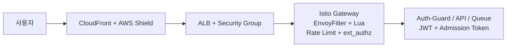

# 보안 개요

Playball 보안 구성은 외부 진입 보호, 요청 검증, 내부 통신 보호, 접근 제어, 감사 추적 흐름으로 운영합니다. 외부 요청 차단과 제한은 Gateway에서 처리하고, 사람 계정 접근은 SSO를 기준으로 관리하며, 운영 변경 이력은 CloudTrail 기준으로 추적합니다.

---

## 보안 목적

| 항목 | 내용 |
|---|---|
| **외부 요청 통제** | CloudFront, ALB, Istio Gateway 계층에서 차단과 제한 수행 |
| **서비스 보호** | WAF, Rate Limit, ext_authz, mTLS로 요청 검사와 내부 통신 보호 수행 |
| **클라이언트 노출 최소화** | 보안 헤더, 소스맵 비활성화, 난독화, 쿠키 속성으로 브라우저 노출 범위 제한 |
| **접근 추적** | SSO 로그인, Role 전환, CloudTrail 이벤트 기준으로 운영 변경 이력 추적 |
| **이상행위 대응** | 인증 실패율, WAF 차단 이벤트, 차단 IP 증가를 보안 알람으로 운영 |

---

## 보호 범위

| 구분 | 내용 |
|---|---|
| **보안 흐름** | CloudFront, ALB, Istio Ingress Gateway, 애플리케이션 검증 계층 |
| **서비스 메시 보안** | EnvoyFilter + Lua, Local/Global Rate Limit, ext_authz, mTLS |
| **클라이언트 보안** | 보안 헤더, 소스맵 비활성화, 난독화, 쿠키/토큰 처리 |
| **접근 제어** | AWS IAM Identity Center SSO, IAM Role, IRSA, Kubernetes RBAC, CloudTrail |
| **봇 대응** | WAF 차단, Rate Limit, ext_authz, Admission Token 검증 |

---

## 보안 계층 구조

---

## 적용 기술

| 영역 | 기술 |
|---|---|
| **Edge / Ingress** | CloudFront, AWS Shield Standard, ALB, Security Group |
| **Gateway 보안** | Istio Ingress Gateway, EnvoyFilter + Lua, Local/Global Rate Limit, ext_authz |
| **내부 통신 보호** | Istio mTLS |
| **인증/토큰** | Auth-Guard, RSA 기반 JWT, Refresh Token Cookie, Admission Token Cookie |
| **접근 제어 / 감사** | AWS IAM Identity Center SSO, IAM Role, IRSA, Kubernetes RBAC, CloudTrail, EventBridge, Lambda |
| **운영 확인** | Grafana, Policy Reporter, CloudTrail, CloudWatch |
