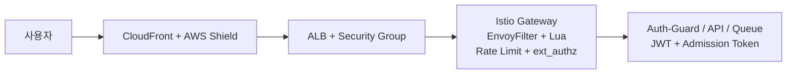

# 개요

Playball 보안 구성은 외부 진입, Istio Gateway, 애플리케이션 검증, 접근 추적 흐름으로 나누어 운영합니다. 외부 요청 차단과 제한은 Gateway에서 처리하고, 인증과 토큰 검증은 애플리케이션 계층에서 처리합니다.

---

## 구성 범위

| 구분 | 내용 |
|---|---|
| **보안 흐름** | CloudFront, ALB, Istio Ingress Gateway, 애플리케이션 검증 계층 |
| **서비스 메시 보안** | EnvoyFilter + Lua, Local/Global Rate Limit, ext_authz, mTLS |
| **클라이언트 보안** | 보안 헤더, 소스맵 비활성화, 난독화, 쿠키/토큰 처리 |
| **접근 제어** | AWS IAM Identity Center, IAM Role, IRSA, Kubernetes RBAC, CloudTrail |
| **봇 대응** | WAF 차단, Rate Limit, ext_authz, Admission Token 검증 |

---

## 보안 계층 구조

---

## 보안 문서 구성

| 문서 | 내용 |
|---|---|
| **보안 흐름** | 외부 진입부터 애플리케이션 검증까지의 계층 구조 |
| **Istio/mTLS** | Gateway 필터, 경로별 제한, 내부 통신 암호화 |
| **클라이언트 보안** | 프론트엔드 노출 제어와 쿠키/토큰 속성 |
| **IAM 접근 제어** | 사람 계정, 워크로드 권한, 감사 이벤트 추적 |
| **봇 대응 체계** | WAF, Rate Limit, ext_authz, 보안 알람 기준 |
